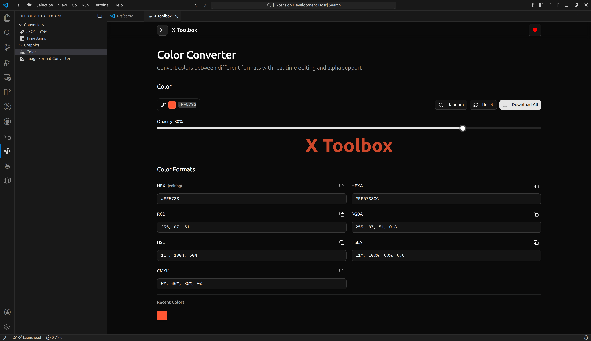

# X Toolbox

  
  
  

A comprehensive Visual Studio Code extension providing essential developer tools directly within your editor. Streamline your workflow with built-in utilities for format conversion, time formatting, encoding/decoding, and more - all without leaving your coding environment.

## Features

### Converters

🔄 Format Conversion

• JSON ↔ YAML: Seamlessly convert between JSON and YAML formats

⏰ Time Utilities

• Timestamp Conversion: Convert between Unix timestamps and human-readable dates

### Graphics

🎨 Color Tools

• Color Format Conversion: Convert between HEX, RGB, HSL, CMYK color formats with real-time preview

• Alpha/Opacity Support: Includes RGBA, HSLA, HEXA formats with opacity slider control

🖼️ Image Processing

• Format Conversion: Convert images between JPG, PNG, WebP, SVG, GIF, BMP formats
• Quality Optimization: Adjust compression level, DPI settings, and file size

### Generators

🆔 UUID Generator

• Bulk Generation: Generate multiple UUIDs at once with copy-friendly formatting

## Showcase

A few screenshots demonstrating the X Toolbox in action.

  
    &nbsp;
  

Tools:

  
  &nbsp;
  

## Requirements

No additional dependencies required. The extension works out-of-the-box with Visual Studio Code version 1.74.0 or higher.

## Commands

Access all tools through the Command Palette (Ctrl+Shift+P or Cmd+Shift+P):

Command Description

`Open X Toolbox` Open the main toolbox interface

## License

This project is licensed under a Private License. All rights reserved.

This is proprietary software owned by the project maintainers. No part of this software may be reproduced, distributed, or transmitted in any form or by any means, including photocopying, recording, or other electronic or mechanical methods, without the prior written permission of the owner, except in cases where such copying is expressly permitted by applicable law.

For licensing inquiries, please contact: [kuloud@outlook.com](mailto:kuloud@outlook.com)

Enhance your development workflow with X Toolbox - because great developers deserve great tools! 🚀
